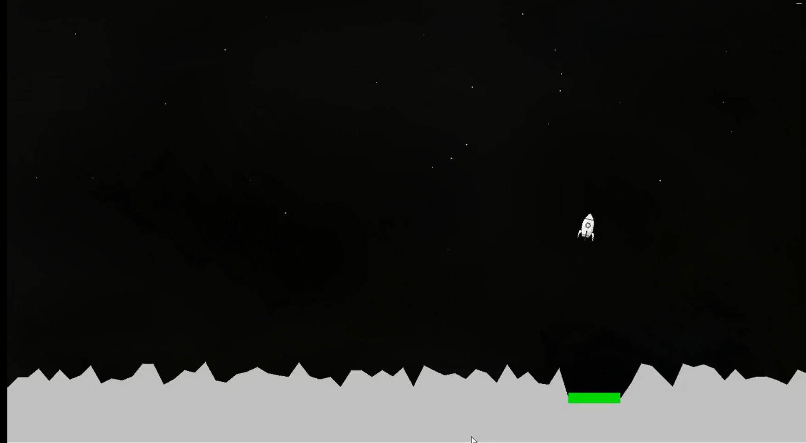

# Rocket Lander MLP Neural Network from Scratch



You can view the complete video of the trained neural network by downloading from here: [Trained Rocket Lander Video](./RocketLanderGameVideo.mp4)

## Project Description
This project implements a simple feedforward neural network (Multilayer Perceptron) in Python to perform regression. The network includes training and validation processes to minimize Root Mean Square Error (RMSE) over epochs and plots trends to evaluate performance. All components of the model, including forward propagation, backpropagation, and weight updates, were implemented from scratch.

## Overview
The project demonstrates the fundamental principles of building and training neural networks manually, without using high-level machine learning frameworks. By working directly with raw data and implementing all calculations, the project provides insights into the inner workings of a neural network. Key objectives include:
1. Developing a fully functional neural network for regression.
2. Understanding how network parameters (e.g., neurons, epochs, learning rate) affect model performance.
3. Visualizing RMSE trends over training to evaluate model learning and potential overfitting.

## Project Structure
- **Data Preprocessing**:
  - Removed duplicates and NaN values.
  - Normalized features to a [0, 1] range.
  - Split the dataset into training (70%), validation (15%), and test (15%) sets.
- **Model Parameters**:
  - User-defined parameters include the number of hidden layer neurons, learning rate (η), activation function scaling (λ), and training epochs.
- **Forward Pass Calculations**:
  - Computed weighted sums and applied a sigmoid activation function at hidden and output layers.
- **Backpropagation**:
  - Calculated errors for output and hidden layers.
  - Updated weights using gradient descent with the specified learning rate.
- **RMSE Visualization**:
  - Plotted RMSE values for training and validation sets over epochs to evaluate model learning and convergence.

## Project Files
- **data/game_data.csv**: Dataset for regression, including features and target values.
- **data/TrainedWeightsAndNumberOfNeurons.csv**: Trained weights of the MLP neural network model.
- **scripts/NeuralNetHolder.py**: Contains the core neural network implementation, including forward propagation, backpropagation, and gradient updates.
- **scripts/RocketLanderNeuralNetwork.py**: Demonstrates the application of the network to a dynamic problem (Rocket Lander simulation).
- **scripts/Datapreprocessing.py**: Contains the Python code used to pre-process the data.
- **README.md**: Project documentation (this file).

## Data Processing Steps
1. **Loading Data**: Imported data and ensured data quality by removing duplicates and NaN values.
2. **Normalization**: Scaled all features to a [0, 1] range to improve model convergence.
3. **Data Splitting**: Divided the data into training, validation, and test sets for robust evaluation.

## Key Features
1. **Custom Neural Network Implementation**:
   - Fully built from scratch with no high-level frameworks.
   - Supports configurable neurons, epochs, and learning rates.
2. **Dynamic Problem Application**:
   - Tested on the Rocket Lander simulation, showcasing its adaptability to dynamic environments.
3. **RMSE Monitoring**:
   - RMSE values for training and validation sets plotted over epochs to track model learning.

## Key Findings
1. **Weight Initialization**:
   - Random initialization provided sufficient variation for effective learning.
2. **Model Convergence**:
   - RMSE values decreased over training epochs, indicating successful learning.
3. **Validation Performance**:
   - Validation RMSE trends highlighted overfitting risks and informed model adjustments.
4. **Test Performance**:
   - The model achieved reasonable RMSE values on unseen data, validating its predictive power.

## Dependencies
The following Python libraries are required:
- `math`
- `random`
- `pandas`
- `matplotlib`

Install dependencies with:
```bash
pip install -r requirements.txt
```

## Conclusion
This project highlights the implementation and training of a feedforward neural network from scratch. By minimizing RMSE and monitoring performance through training epochs, it demonstrates the core principles of neural networks and their application in solving regression tasks.

## Contributing
Contributions are welcome! If you find any issues or want to improve the code, feel free to open a pull request or create an issue in the repository.

## License
This project is licensed under the [MIT License](./LICENSE). See the LICENSE file for more details.
